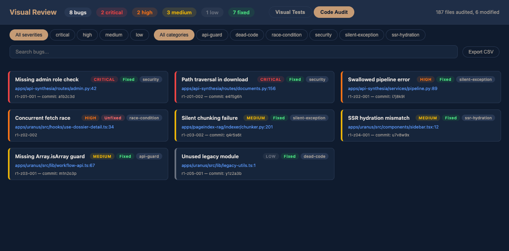
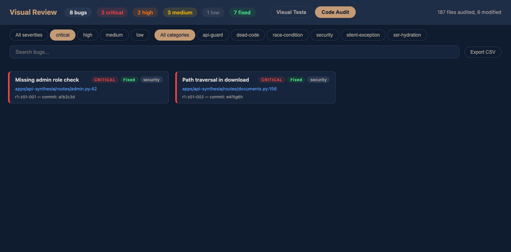
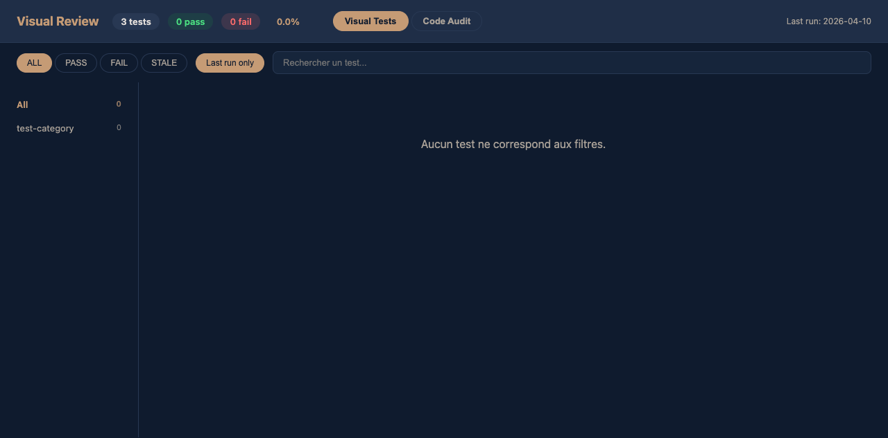

# ShipGuard

**AI-powered code audit + visual E2E testing. Zero tests written.**

You push code. You don't know what you broke. ShipGuard dispatches parallel AI agents to find bugs in your code, then visually verifies the impacted pages with real browser screenshots. No test files to write, no test infrastructure to maintain.

---

## The flow

```
/sg-code-audit              # Find bugs in code
/sg-visual-run --from-audit # Verify impacted routes visually
/sg-visual-review           # See everything in one dashboard
```

---

## Install

```bash
claude plugin add bacoco/shipguard
```

That's it. Restart Claude Code and the `/sg-*` commands are ready.

---

## Skills

| Skill | What it does |
|-------|-------------|
| `/sg-code-audit` | Dispatch parallel agents to find and fix bugs across your repo |
| `/sg-visual-run` | Run visual tests with agent-browser -- scripted or natural language |
| `/sg-visual-review` | Interactive dashboard -- screenshots + code audit in one page |
| `/sg-visual-discover` | Scan your app and generate YAML test manifests automatically |
| `/sg-visual-fix` | Read annotated screenshots, trace bugs to source, fix and verify |
| `/sg-visual-review-stop` | Stop the review dashboard server |

---

## Screenshots

### Code Audit


### Visual Tests


---

## Code Audit Modes

| Mode | Agents | Rounds | What it finds |
|------|--------|--------|---------------|
| `quick` | 5 | 1 | Known patterns, lint-like issues |
| `standard` | 10 | 1 | Broader coverage, standard audit |
| `deep` | 15 | 2 | + runtime behavior, race conditions |
| `paranoid` | 20 | 3 | + edge cases, security, logic errors |

```
/sg-code-audit --mode paranoid
```

---

## How it works

1. **Code audit** -- Parallel agents scan your codebase for bugs, grouped by severity
2. **Route mapping** -- Impacted routes are identified from the audit results
3. **Visual testing** -- Real browser sessions screenshot every impacted page
4. **AI inspection** -- Each screenshot is analyzed for visual regressions
5. **Fix loop** -- Annotate problems on screenshots, the AI traces them to source and fixes

Tests are YAML manifests that describe what the user sees -- not how the DOM is structured. When a CSS class changes, selector-based tests break. These don't.

---

## Proven at scale

112 routes. 16 backend services. 6 authentication flows. Next.js, React, Vue, Angular -- any framework with detectable routes. Handles JWT auth, feature flags, file uploads, multi-step workflows, responsive layouts.

---

## License

MIT
